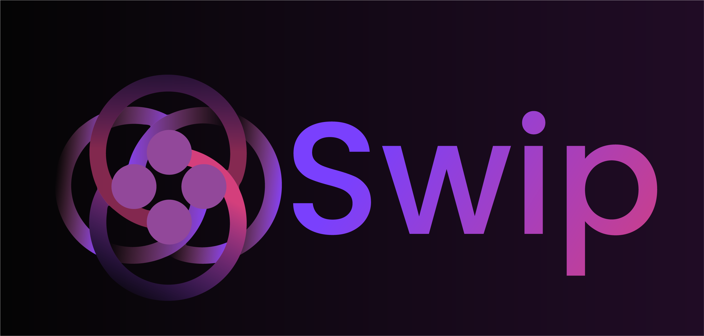

<div align="center">
  
  
  # SWIP Dashboard
  
  [](https://github.com/synheart-ai/synheart_wear)
  [](https://nextjs.org)
  [](LICENSE)
  
  An open-source transparency interface for the Synheart Wellness Impact Protocol (SWIP).  
  Built with **Next.js (App Router)**, **TypeScript**, **Tailwind**, **shadcn/ui**, **Prisma (PostgreSQL)**, and **Better Auth**.
</div>

## 🚀 Features

### Public Interface
- **Global Leaderboard**: Rank apps by their wellness impact scores over the last 30 days
- **Sessions Explorer**: Browse anonymized session data with interactive charts
- **Data Visualization**: SWIP score trends and emotion distribution analytics

### Developer Portal
- **App Registration**: Create and manage wellness applications
- **API Key Management**: Generate secure API keys for data submission
- **Session Monitoring**: Track ingestion status and app performance

### API Integration
- **SWIP Ingestion**: `/api/swip/ingest` for session data submission
- **Public Data Access**: `/api/public/swipsessions` for transparent browsing
- **Developer APIs**: App and API key management endpoints

## 🏗️ Architecture

### Frontend
- **Framework**: Next.js 15 (App Router)
- **UI**: TailwindCSS + Custom Components
- **Charts**: Custom React components with CSS animations
- **Auth**: Better Auth with OAuth (GitHub, Google)

### Backend
- **API Routes**: Next.js server actions
- **Database**: PostgreSQL with Prisma ORM
- **Scoring**: Enhanced SWIP algorithm based on HRV metrics
- **Security**: API key authentication and Redis rate limiting

## 📊 SWIP Scoring Algorithm

The SWIP scoring system evaluates wellness impact based on:

- **HRV Metrics**: RMSSD and SDNN analysis for autonomic balance
- **Emotional State**: Calm, focused, stressed, etc.
- **Heart Rate Variability**: Coefficient of variation analysis
- **Score Range**: 0-100 (higher = better wellness impact)

### Scoring Factors
- **Base Score**: 50 points
- **RMSSD Bonus**: Up to +25 points for high parasympathetic activity
- **SDNN Bonus**: Up to +20 points for good overall variability
- **Emotion Modifiers**: +10 (calm), +5 (focused), -15 (stressed)
- **Variability Bonus**: +5 points for healthy HR/RR variance

## 🚀 Quickstart

1. **Environment Setup**
   ```bash
   cp .env.example .env.local
   # Fill in your DATABASE_URL, NEXTAUTH_SECRET, and OAuth credentials
   ```

2. **Install Dependencies**
   ```bash
   npm install
   ```

3. **Database Setup**
   ```bash
   npx prisma generate
   npx prisma migrate dev
   ```

4. **Start Development Server**
   ```bash
   npm run dev
   ```

5. **Access the Dashboard**
   - Open [http://localhost:3000](http://localhost:3000)
   - Navigate to Developer Portal to create apps and API keys
   - Use the API examples in `API_EXAMPLES.md`

## 📝 API Usage

### Submit Session Data
```bash
curl -X POST http://localhost:3000/api/swip/ingest \
  -H "Content-Type: application/json" \
  -H "x-api-key: YOUR_API_KEY" \
  -d '{
    "app_id": "your_app_id",
    "session_id": "session_12345",
    "metrics": {
      "hr": [72, 75, 73, 78, 76],
      "rr": [16, 15, 17, 16, 15],
      "hrv": {
        "sdnn": 52.3,
        "rmssd": 48.7
      },
      "emotion": "calm",
      "timestamp": "2025-10-20T08:00:00Z"
    }
  }'
```

### Get Public Sessions
```bash
curl http://localhost:3000/api/public/swipsessions
```

## 🗂️ Project Structure

```
swip-dashboard/
├── app/                    # Next.js App Router
│   ├── api/               # API routes
│   │   ├── swip/ingest/   # Session data ingestion
│   │   ├── public/swipsessions/ # Public data access
│   │   ├── apps/          # App management
│   │   ├── api-keys/      # API key management
│   │   └── auth/          # Better Auth endpoints
│   ├── developer/         # Developer portal pages
│   ├── leaderboard/       # Global leaderboard
│   ├── swipsessions/      # Sessions explorer
│   ├── auth/              # Authentication pages
│   └── profile/           # User profile management
├── components/            # React components
│   ├── CreateAppForm.tsx  # App creation form
│   ├── GenerateApiKeyForm.tsx # API key generation
│   ├── SessionsChart.tsx  # Data visualization
│   └── Header.tsx         # Dynamic header component
├── src/
│   ├── lib/               # Core utilities
│   │   ├── auth.ts        # Better Auth configuration
│   │   ├── auth-client.ts # Better Auth client
│   │   ├── db.ts          # Prisma client
│   │   ├── swip.ts        # SWIP scoring algorithm
│   │   ├── redis.ts       # Redis client
│   │   ├── ratelimit.ts   # Rate limiting
│   │   └── logger.ts      # Structured logging
│   └── client/
│       └── examples.http  # API testing examples
├── prisma/
│   └── schema.prisma      # Database schema
├── API_DOCUMENTATION.md   # Complete API reference
├── API_REFERENCE.md       # Quick developer guide
└── API_EXAMPLES.md        # Practical examples
```

## 🔧 Scripts

- `dev` – Start Next.js development server
- `build` – Production build
- `start` – Start production server
- `lint` – Lint code with ESLint
- `prisma:generate` – Generate Prisma client
- `prisma:migrate` – Run database migrations

## 📋 Database Schema

### Core Tables
- **Users**: Developer accounts (Better Auth integration)
- **Apps**: Registered wellness applications
- **ApiKeys**: Secure API keys for app authentication
- **SwipSessions**: Anonymized session data with SWIP scores
- **LeaderboardSnapshot**: Calculated rankings (30-day windows)
- **Session**: Better Auth session management
- **Account**: OAuth account linking
- **Verification**: Email verification tokens

### Key Relationships
- Users → Apps (one-to-many)
- Apps → SwipSessions (one-to-many)
- Apps → ApiKeys (one-to-many)
- Apps → LeaderboardSnapshot (one-to-many)

## 🔒 Security & Privacy

- **Data Anonymization**: All session data is anonymized at ingestion
- **API Key Authentication**: Secure key-based access control
- **Redis Rate Limiting**: Distributed protection against abuse
- **OAuth Authentication**: GitHub and Google social login
- **Privacy Compliance**: Follows Synheart Open Standard (SOS-1.0)

## 🌟 MVP Features Completed

✅ **Core Infrastructure**
- Next.js 15 App Router setup
- Prisma database integration
- Better Auth with OAuth (GitHub, Google)
- TailwindCSS styling with custom theme

✅ **Developer Portal**
- App registration and management
- API key generation and tracking
- Session monitoring dashboard
- Edit/delete functionality for apps

✅ **Public Interface**
- Global leaderboard with 30-day rankings
- Sessions explorer with data visualization
- Interactive charts and analytics

✅ **API Integration**
- SWIP ingestion endpoint with Redis rate limiting
- Public data access endpoint
- Developer management APIs
- Comprehensive API documentation

✅ **SWIP Scoring**
- Enhanced HRV-based algorithm
- Emotional state analysis
- Automatic leaderboard updates

✅ **Authentication**
- Better Auth integration
- OAuth social login (GitHub, Google)
- User profile management
- Session management

✅ **Production Ready**
- Redis integration for caching and rate limiting
- Structured logging with Winston
- Health check endpoints
- Security headers and CORS
- Database connection pooling

## 🚧 Current Status

- **OAuth Endpoints**: Successfully implemented with Better Auth
- **Core Functionality**: All SWIP features working perfectly
- **API Documentation**: Complete documentation created
- **Database**: Fully functional with proper schema

## 📄 License

**MIT License** — Open contribution and transparency encouraged.

All public data is anonymized and complies with the **Synheart Open Standard (SOS-1.0)** privacy rules.

## 🤝 Contributing

1. Fork the repository
2. Create a feature branch
3. Make your changes
4. Add tests if applicable
5. Submit a pull request

## 📞 Support

- **Documentation**: [SWIP Protocol RFC](https://github.com/synheart-ai/swip)
- **Issues**: [GitHub Issues](https://github.com/synheart-ai/swip-dashboard/issues)
- **Community**: [Synheart Discord](https://discord.gg/synheart)

---

**Built with ❤️ by Israel Goytom and the Synheart AI Team**
